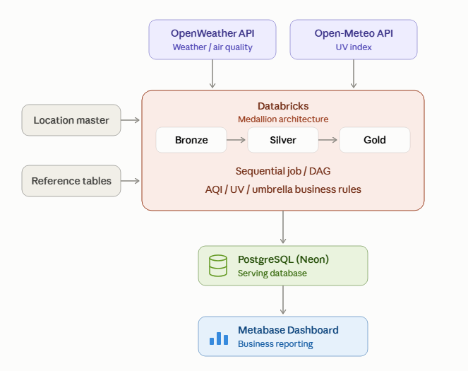
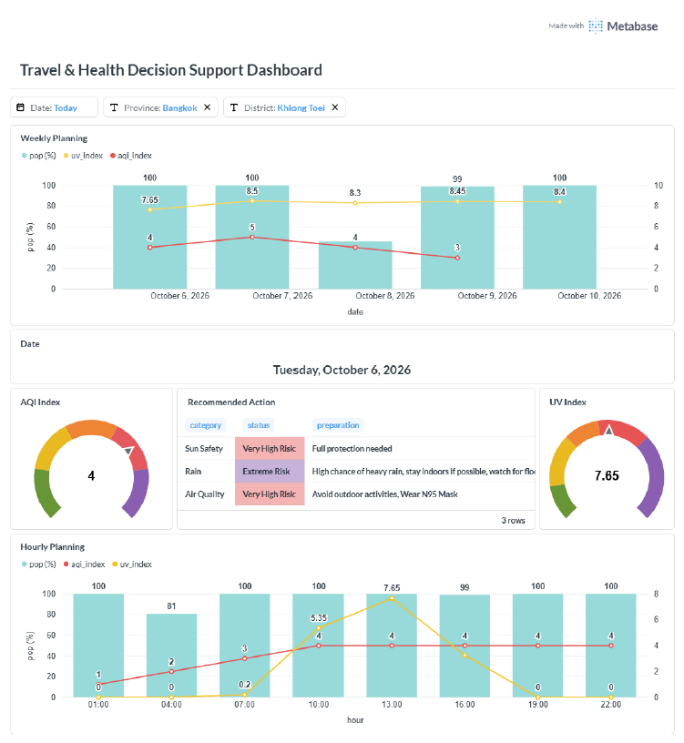

# Weather & Environmental Data Engineering Pipeline

An end-to-end Data Engineering project that collects weather and environmental data from external APIs, processes the data using a Bronze–Silver–Gold architecture in Databricks, and delivers business-ready datasets to PostgreSQL for visualization in Metabase.

The project is designed to support daily travel and outdoor activity decisions by combining weather conditions, precipitation, UV index, and air quality data across locations in Thailand.

---

## Architecture



### Data Flow

```text
OpenWeather API ─────┐
                     │
Open-Meteo API ──────┤
                     ▼
              Databricks
                     │
              Bronze Layer
                     │
                     ▼
              Silver Layer
                     │
                     ▼
               Gold Layer
                     │
                     ▼
             PostgreSQL / Neon
                     │
                     ▼
             Metabase Dashboard
```

The pipeline is orchestrated using a sequential Databricks Job.

```text
ingest_weather
        ↓
ingest_air_quality
        ↓
ingest_uv_index
        ↓
clean_weather
        ↓
clean_air_quality
        ↓
clean_uv_index
        ↓
gold_summary
        ↓
export_to_postgresql
```

---

## Project Objectives

* Build an end-to-end data pipeline from API ingestion to BI consumption.
* Apply a Bronze–Silver–Gold data architecture.
* Process and transform API data using PySpark and Spark SQL.
* Implement data quality checks, deduplication, and validation.
* Apply rule-based transformations for weather, UV, and air quality data.
* Deliver Gold datasets to PostgreSQL for downstream analytics.
* Build a Metabase dashboard for travel and environmental insights.

---

## Data Sources

### OpenWeather API

Provides:

* Weather forecast data
* Air quality forecast data

### Open-Meteo API

Provides:

* UV index forecast data

---

## Technology Stack

| Category                 | Technology                     |
| ------------------------ | ------------------------------ |
| Data Processing          | Databricks, PySpark, Spark SQL |
| Storage / Data Lake      | Delta Lake                     |
| Data Architecture        | Bronze–Silver–Gold             |
| Data Source              | REST APIs                      |
| Database / Serving Layer | PostgreSQL, Neon               |
| Visualization            | Metabase                       |
| Language                 | Python, SQL                    |

---

## Data Architecture

### Bronze Layer

The Bronze layer stores raw API responses together with ingestion metadata.

Main tables:

* `workspace.bronze.weather_raw`
* `workspace.bronze.air_quality_raw`
* `workspace.bronze.uv_index_raw`

Raw API responses are preserved in JSON format before transformation.

---

### Silver Layer

The Silver layer parses and cleans the raw API data.

Main processing includes:

* JSON schema parsing
* Array explosion
* Timestamp conversion
* Null validation
* Deduplication
* Data type conversion
* Derived fields
* Delta Lake `MERGE`

Main tables:

* `workspace.silver.weather_clean`
* `workspace.silver.air_quality_clean`
* `workspace.silver.uv_index_clean`

---

### Gold Layer

The Gold layer contains business-ready datasets for downstream consumption.

Main tables:

* `workspace.gold.weather_summary`
* `workspace.gold.air_quality_summary`
* `workspace.gold.uv_index_summary`
* `workspace.gold.all_weather_environmental_summary`

The final consolidated dataset combines weather, UV, air quality, and location information for dashboard consumption.

---

## Reference Data

The pipeline uses supporting reference datasets for reusable business rules.

### Location Master

`workspace.reference.location_master`

Contains location information used during API ingestion and downstream processing.

The current dataset covers locations in:

* Bangkok
* Ayutthaya
* Nakhon Pathom
* Chanthaburi

The location list can be extended by adding new records to the master table.

### Business Rule Reference Tables

* `workspace.reference.aqi_guidline`
* `workspace.reference.uv_index_guidline`
* `workspace.reference.umbrella_guidline`

These tables provide reference values used by the Gold layer to derive business-oriented classifications.

> Location Master and Reference Tables are supporting datasets used by the notebooks. They are not separate tasks in the Databricks Job.

---

## Data Quality & Validation

Data quality checks are applied during the transformation and delivery process.

Examples include:

* Null key validation
* Duplicate detection and removal
* Source data filtering
* Record count comparison
* Delta `MERGE` validation
* Source-to-destination row count validation during PostgreSQL export

The export process compares the source Gold table row count with the destination PostgreSQL table row count and raises an error when the counts do not match.

More details are available in:

[`docs/data_quality.md`](docs/data_quality.md)

---

## Data Delivery

After the Gold layer is processed, the datasets are exported from Databricks to PostgreSQL on Neon.

```text
Databricks Gold
      ↓
04_export_to_neon
      ↓
PostgreSQL / Neon
      ↓
Metabase
```

PostgreSQL serves as the downstream serving layer for the Metabase dashboard.

---

## Dashboard



The Metabase dashboard provides an interactive view of weather and environmental conditions across locations.

The dashboard includes information such as:

* Weather conditions
* UV Radiation
* Air Quality
* Location Mapping

The complete dashboard is also available as:

[`Metabase Dashboard PDF`](<dashboard/Metabase - Travel & Health Decision Support Dashboard.pdf>)

---

## Project Structure

```text
weather-data-engineering/
│
├── README.md
│
├── architecture/
│   └── architecture.md
│
├── notebooks/
│   ├── bronze/
│   ├── silver/
│   ├── gold/
│   └── delivery/
│
├── docs/
│   ├── data_quality.md
│   ├── business_rules.md
│   ├── design_decisions.md
│   └── data_dictionary.md
│
├── dashboard/
│   ├── metabase.md
│   └── metabase_dashboard.pdf
│
├── screenshots/
   ├── architecture.png
   ├── databricks_job_dag.png
   └── metabase_dashboard.png

```

---

## Documentation

More detailed documentation is available in the following sections:

* [System Architecture](architecture/architecture.md)
* [Data Quality](docs/data_quality.md)
* [Business Rules](docs/business_rules.md)
* [Design Decisions](docs/design_decisions.md)
* [Data Dictionary](docs/data_dictionary.md)
* [Metabase Dashboard](dashboard/metabase.md)

---

## Key Data Engineering Practices

This project demonstrates practical Data Engineering concepts including:

* REST API ingestion
* Incremental data processing
* Bronze–Silver–Gold architecture
* PySpark transformations
* Spark SQL
* Delta Lake
* Delta `MERGE`
* Data deduplication
* Data quality validation
* Rule-based transformations
* Sequential job orchestration
* PostgreSQL data delivery
* Source-to-destination validation
* BI data serving

---

## Disclaimer

This is a personal Data Engineering portfolio project created for learning and demonstration purposes.

API credentials, database credentials, and other sensitive configuration values are excluded from the repository.
