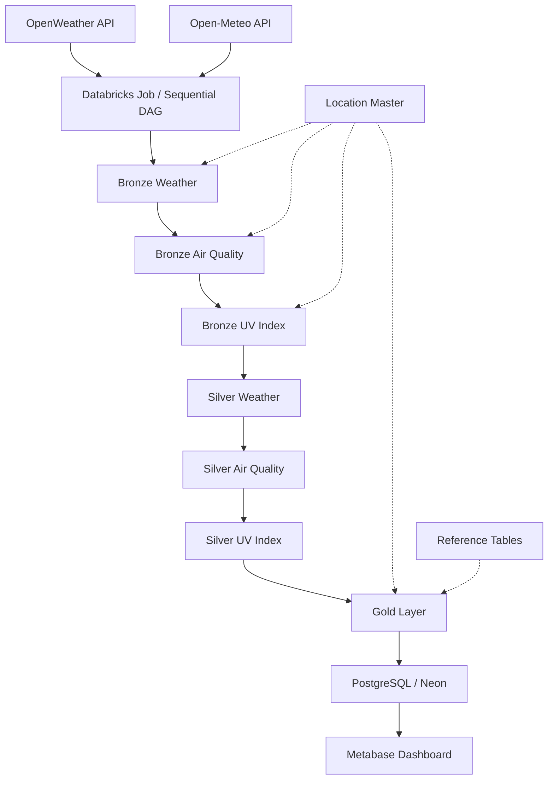

# System Architecture

The project implements an end-to-end data pipeline using a **Bronze-Silver-Gold architecture** in Databricks.

The pipeline collects weather and environmental data from external REST APIs, processes the data through multiple transformation layers, and delivers the final Gold datasets to PostgreSQL (Neon) for visualization in Metabase.

## Architecture Overview



> **Note:** Location Master and Reference Tables are existing reference datasets. They are read by the processing notebooks but are not executed as tasks within the Databricks Job.

## Data Flow

The pipeline is orchestrated using a **Databricks Job with a sequential DAG**.

The workflow runs in the following order:

```text
Bronze Weather
      ↓
Bronze Air Quality
      ↓
Bronze UV Index
      ↓
Silver Weather
      ↓
Silver Air Quality
      ↓
Silver UV Index
      ↓
Gold
      ↓
Export to PostgreSQL / Neon
      ↓
Metabase Dashboard
```

Location Master and Reference Tables are used as supporting datasets during processing but are not part of the Job task sequence.

## 1. Data Sources

The pipeline retrieves data from external REST APIs.

### OpenWeather API

Provides:

* Weather forecast data
* Air quality data

### Open-Meteo API

Provides:

* UV index data

## 2. Location Master

The `location_master` table provides the locations used by the ingestion process.

```text
workspace.reference.location_master
```

The ingestion notebooks read this table to determine which locations should be processed.

The location master is not executed as part of the Databricks Job. It is an existing reference dataset used by the ingestion and downstream processing logic.

The table is designed to be extendable by adding new locations without changing the main ingestion logic.

## 3. Databricks Job Orchestration

The pipeline is orchestrated using **Databricks Jobs**.

The Job contains notebook tasks arranged as a sequential DAG:

```text
01_ingest_weather
        ↓
01_ingest_air_quality
        ↓
01_ingest_uv_index
        ↓
02_silver_weather
        ↓
02_silver_air_quality
        ↓
02_silver_uv_index
        ↓
03_gold
        ↓
04_export_to_neon
```

Each task starts after the previous task has completed successfully.

The DAG therefore provides a controlled execution sequence from raw data ingestion through transformation, Gold-layer processing, and final PostgreSQL delivery.

## 4. Bronze Layer

The Bronze layer stores raw API responses together with ingestion metadata.

### Bronze Tables

```text
workspace.bronze.weather_raw
workspace.bronze.air_quality_raw
workspace.bronze.uv_index_raw
```

The ingestion tasks collect data from the external APIs and store the raw responses in Delta tables.

Metadata includes:

* `location_id`
* `source`
* `ingestion_time`
* `ingestion_time_thai`
* `raw_json`

The Bronze layer preserves the source data before structured transformations are applied.

## 5. Silver Layer

The Silver layer parses, cleans, validates, and transforms the raw Bronze data into structured datasets.

### Silver Tables

```text
workspace.silver.weather_clean
workspace.silver.air_quality_clean
workspace.silver.uv_index_clean
```

The Silver transformations include:

* Parsing nested JSON responses
* Exploding nested and array structures
* Converting timestamps to Thailand time
* Converting temperature from Kelvin to Celsius
* Handling missing values
* Filtering invalid key fields
* Removing duplicate records
* Creating derived fields
* Applying data quality validation
* Merging transformed records into Delta tables

## 6. Reference Tables

Reference tables provide reusable information used during data transformation and Gold-layer processing.

Examples include:

```text
workspace.reference.aqi_guidline
workspace.reference.uv_index_guidline
workspace.reference.umbrella_guidline
```

These tables contain predefined classifications and business rules used to enrich and categorize the processed data.

Examples include:

* Air quality classification
* UV index classification
* Rain and umbrella recommendation

Reference tables are not executed as tasks within the Databricks Job. They are existing datasets that are read by the processing notebooks.

## 7. Gold Layer

The Gold layer contains business-ready datasets designed for downstream consumption.

### Gold Tables

```text
workspace.gold.weather_summary
workspace.gold.air_quality_summary
workspace.gold.uv_index_summary
workspace.gold.all_weather_environmental_summary
```

The Gold processing combines the cleaned Silver data with reference information and applies the required business rules.

The `all_weather_environmental_summary` dataset provides a consolidated view of:

* Weather conditions
* Air quality
* UV index
* Location information

## 8. PostgreSQL / Neon Delivery

After the Gold processing is completed, the final datasets are exported from Databricks to **PostgreSQL hosted by Neon**.

The export process:

1. Reads the Gold datasets from Databricks.
2. Writes the datasets to PostgreSQL.
3. Compares source and destination row counts.
4. Raises an error if the row counts do not match.

PostgreSQL acts as the serving layer for the Metabase dashboard.

The data flow is:

```text
Databricks Gold
      ↓
PostgreSQL / Neon
      ↓
Metabase
```

## 9. Metabase Dashboard

Metabase connects to PostgreSQL / Neon as the dashboard data source.

The dashboard allows users to explore:

* Weather conditions
* UV Radiation
* Air Quality
* Location Mapping

The dashboard is designed to support daily and travel-related decisions based on weather and environmental conditions.

## Architecture Responsibilities

| Component            | Responsibility                                     |
| -------------------- | -------------------------------------------------- |
| OpenWeather API      | Weather and air quality data source                |
| Open-Meteo API       | UV index data source                               |
| Location Master      | Defines locations processed by ingestion tasks     |
| Databricks Job / DAG | Controls task execution order and dependencies     |
| Bronze Layer         | Stores raw API responses                           |
| Silver Layer         | Parses, cleans, validates, and transforms data     |
| Reference Tables     | Stores reusable classifications and business rules |
| Gold Layer           | Produces business-ready datasets                   |
| PostgreSQL / Neon    | Serves processed data to Metabase                  |
| Metabase             | Provides data visualization and dashboarding       |

## Overall Architecture

```text
                     External REST APIs
                    ┌───────────────────┐
                    │ OpenWeather API   │
                    │ Open-Meteo API    │
                    └─────────┬─────────┘
                              │
                              ▼
                  ┌────────────────────────┐
                  │ Databricks Job / DAG   │
                  │   Sequential Workflow  │
                  └────────────┬───────────┘
                               │
                               ▼
                        Bronze Weather
                               │
                               ▼
                       Bronze Air Quality
                               │
                               ▼
                          Bronze UV
                               │
                               ▼
                        Silver Weather
                               │
                               ▼
                     Silver Air Quality
                               │
                               ▼
                          Silver UV
                               │
                               ▼
                          Gold Layer
                               │
                               ▼
                      PostgreSQL / Neon
                               │
                               ▼
                      Metabase Dashboard


Location Master ───────────────► Processing
Reference Tables ──────────────► Gold
```

## Design Summary

The architecture separates data ingestion, transformation, business rules, data serving, and visualization into distinct stages.

The Databricks Job manages the sequential execution of the processing notebooks, while Location Master and Reference Tables act as supporting datasets rather than Job tasks.

This structure provides a clear end-to-end pipeline from external APIs to the final dashboard.
